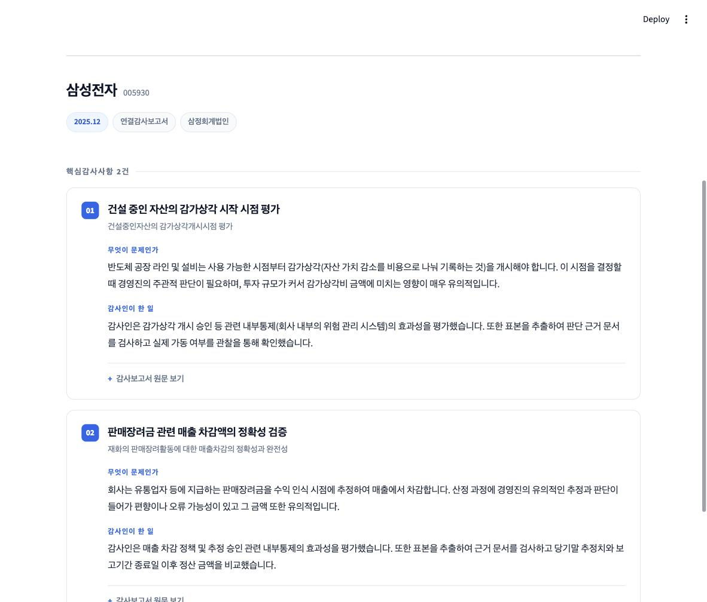
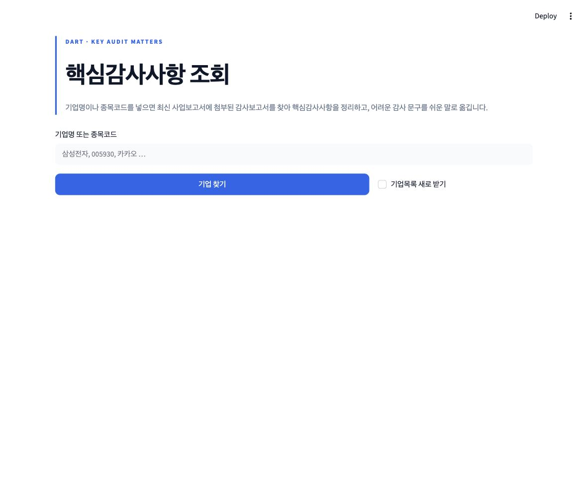

# DART 핵심감사사항(KAM) 조회

**기업명 하나로 최신 감사보고서의 핵심감사사항을 찾아, 감사 문구를 쉬운 말로 풀어주는 웹 도구.**

[](https://kamgit-y2zkb7u53wcmbg2uoqder5.streamlit.app/)




---

## 이게 왜 필요한가

핵심감사사항(Key Audit Matters)은 감사인이 그 기업의 재무제표를 감사하면서
**가장 중요하게 다룬 사항**입니다. 회사의 회계 이슈와 감사인이 어디에 집중했는지가 드러납니다.

문제는 하나를 보려면 매번 이 과정을 거쳐야 한다는 것입니다.

```
DART 접속 → 기업 검색 → 최신 사업보고서 → 첨부문서 목록
        → 연결/별도 감사보고서 선택 → 독립된 감사인의 감사보고서 → 핵심감사사항
```

한 곳만 볼 때는 별일 아니지만, 여러 기업을 반복해서 보려면 번거롭습니다.
게다가 원문 표현이 낯설어 회계·감사에 익숙하지 않으면 바로 이해하기 어렵습니다.

이 도구는 **그 경로를 한 번에 통과하고, 원문 옆에 쉬운 설명을 붙여줍니다.**

## 무엇을 보여주나

| | |
|---|---|
| **기업 정보** | 기업명, 종목코드, 보고기간, 감사인, 연결/별도 구분, 정정공시 여부 |
| **핵심감사사항** | 항목별 제목 · 선정 이유 · 감사인의 대응 절차 |
| **쉬운 설명** | 각 항목을 "무엇이 문제인가 / 감사인이 한 일"로 풀어쓴 Gemini 요약 |
| **원문** | 감사보고서 원문과 DART 원본 링크 (항상 함께 제공) |



---

## 설계에서 신경 쓴 것

### AI는 설명에만 쓴다

어느 기업의, 어느 공시의, 어느 감사보고서를 골랐는지는 **재현 가능하고 원문으로 추적**할 수 있어야
합니다. 그래서 이 선택 과정은 전부 규칙 기반입니다. AI는 이미 확보한 원문을 읽기 쉽게 옮기는
역할만 하고, 실패하더라도 원문 표시는 그대로 남습니다.

### "KAM이 없는 것"과 "찾지 못한 것"은 다르다

둘을 같은 실패로 표시하면 사용자가 잘못된 판단을 하게 됩니다. 네 가지로 구분합니다.

| 상태 | 의미 |
|---|---|
| `success` | 핵심감사사항을 정상적으로 추출 |
| `kam_not_present` | 감사보고서는 찾았으나 핵심감사사항이 **기재되어 있지 않음** |
| `manual_review_required` | 원문은 찾았으나 구조를 완전히 해석하지 못함 → 원문 직접 확인 안내 |
| `failed` | 조회 단계에서 실패 → **어느 단계에서 왜** 실패했는지 표시 |

파싱이 불완전할 때 억지로 성공으로 처리하지 않습니다.

### 정정공시는 원공시까지 따라간다

정정 사업보고서가 첨부목록에 보여주는 `dcmNo`가 **원공시에 속해 있는 경우**가 있습니다.
그러면 정정 접수번호로는 감사보고서를 열 수 없습니다.

> 실제 사례 — 제주항공 2025.12
> 정정공시 `20260515002339`는 연결감사보고서 `dcmNo=11142830`을 보여주지만,
> 그 조합으로 요청하면 목차가 빈 페이지가 옵니다.
> 원공시 `20260318001439` + 같은 `dcmNo`로는 정상 조회됩니다.

원공시 접수번호를 어딘가에서 파싱해 오는 대신, **같은 사업연도의 공시를 접수일 역순으로
훑으며 첫 성공을 채택**합니다. 이 한 루프가 정정 불일치·첨부 누락·목차 없음을 모두 흡수합니다.

### 실패는 캐시하지 않는다

일시적인 네트워크 오류를 캐시에 남기면, 문제가 해결된 뒤에도 옛 실패가 계속 돌아옵니다.
`success`와 `kam_not_present`만 저장합니다. AI 설명 캐시의 키에는 원문 해시가 들어가므로
원문이 바뀌면 설명도 자동으로 새로 만들어집니다.

### 문장을 부수지 않고 텍스트로 바꾼다

DART 문서는 문장 중간에도 인라인 태그가 끼어듭니다. 모든 태그를 개행으로 바꾸면 문장이
조각나 파싱이 불가능해집니다.

```
카카오 감사보고서 원문:
  "...우리의 의견형성 <span>시</span> 다루어졌으며, 우리는 <b>이런</b> 사항에..."

단순 태그→개행:  "의견형성 | 시 | 다루어졌으며, 우리는 | 이런 | 사항에"   ← 부서짐
블록 태그만 개행: "의견형성 시 다루어졌으며, 우리는 이런 사항에"          ← 복원
```

같은 이유로 표 형식과 서술형을 나누지 않습니다. HTML을 블록 단위 텍스트로 평탄화하면
표도 행 텍스트가 되므로, 한 파서가 둘 다 처리합니다.

### 배포 환경에서는 국내 리전 중계를 거친다

Streamlit Community Cloud는 해외 리전에서 실행되는데, FSS 서버가 그 연결을 받아주지
않습니다(실측: `ConnectTimeout`. 같은 요청이 국내에서는 정상 응답). `DART_PROXY_BASE`를
설정하면 서울 리전에 올린 중계([`api/dart.js`](api/dart.js))를 거쳐 나갑니다.
설정이 없으면 직접 연결하므로 로컬에서는 그대로 동작합니다. → [`api/README.md`](api/README.md)

---

## 설치와 실행

```bash
python3 -m venv .venv
.venv/bin/pip install -r requirements.txt

cp .streamlit/secrets.toml.example .streamlit/secrets.toml
# secrets.toml 에 키를 채운 뒤
.venv/bin/streamlit run app.py
```

| 키 | 필수 | 발급처 |
|---|---|---|
| `OPENDART_API_KEY` | 필수 | [OpenDART](https://opendart.fss.or.kr) (무료, 일 20,000건) |
| `GEMINI_API_KEY` | 선택 | [Google AI Studio](https://aistudio.google.com/apikey) — 없으면 원문만 표시 |
| `DART_PROXY_BASE` | 선택 | 해외 리전 배포 시에만 필요 |

AI 모델은 `kam/settings.py`의 `GEMINI_MODELS`를 앞에서부터 시도합니다.
모델이 폐기되거나(404) 일시적으로 과부하일 때(503) 다음 모델로 넘어갑니다. 둘 다 실제로 겪은 실패입니다.

## 테스트

```bash
.venv/bin/python -m pytest tests/ -q     # 61 passed
```

파서 테스트는 **실제 DART 감사보고서 HTML**을 `tests/fixtures/`에 저장해 두고 씁니다.
네트워크 없이 돌아가며, 아래 실제 사례를 회귀 테스트로 고정합니다.

| fixture | 고정하는 사례 |
|---|---|
| 삼성전자 | KAM 2건 정상 추출 |
| SK하이닉스 | `1) 핵심감사사항으로 결정한 이유` — 번호 붙은 소제목 |
| 카카오 | 인라인 태그로 쪼개진 문장 복원 |
| 쌍용씨앤이 | KAM이 실제로 없는 경우 |
| 제주항공 | 정정공시 ↔ 원공시 `dcmNo` 불일치 |

## 추출 성공률 측정

```bash
OPENDART_API_KEY=... .venv/bin/python scripts/validate_batch.py 20
```

**모든 상장기업에서 정확히 추출된다고 보장하지 않습니다.** 이 스크립트가 실제 성공률을
숫자로 알려주고, 앱은 불완전한 파싱을 성공으로 위장하지 않으며 항상 DART 원문 링크를 함께 제공합니다.

## 구조

```
app.py                Streamlit 화면
kam/
  corp_index.py       corpCode.xml → 기업 검색 (앞자리 0 보존, 영문 포함 종목코드 대응)
  dart_api.py         OpenDART list.json + 오류코드 한국어 해석
  dart_doc.py         DART 뷰어 스크래핑 (첨부목록 / 목차 / 원문)
  html_text.py        HTML → 블록 텍스트
  kam_parser.py       텍스트 → 핵심감사사항 구조 + 상태 판정
  resolver.py         위 조각을 잇고 정정공시를 처리
  summarize.py        Gemini 설명 (실패해도 원문 표시는 유지)
  cache.py            성공 결과만 캐시
  http.py             DART 요청 단일 창구 (중계 경유 여부 결정)
  style.py            화면 스타일
api/dart.js           서울 리전 DART 중계 (Vercel)
scripts/              추출 성공률 측정
tests/                파서 회귀 테스트 + 실제 DART fixture
```

## 참고

DART 공시 데이터의 저작권은 금융감독원에 있습니다. 이 도구는 공개된 전자공시를 조회해
보여줄 뿐이며, 표시된 내용의 정확성을 보증하지 않습니다. **투자 판단의 근거로 쓰지 마시고,
반드시 DART 원문을 확인하세요.**
